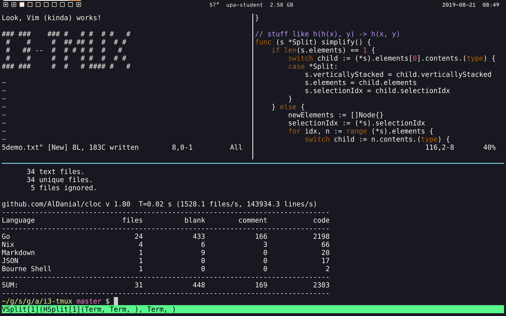

# tmux2

Most of the features implemented by this already exist in `tmux`.

The difference is that `tmux2` comes with sane default with a few nice touches.

## Features
- [x] scrollback with your mouse or scroll wheel
- [x] i3-like window manager with i3-like controls
- [x] resize windows via keyboard
- [x] resize windows by dragging mouse
- [x] fullscreen mode
- [x] text selection in fullscreen mode
- [ ] text search
- [ ] reading i3 configs
- [ ] reading tmux configs

## Getting Started

Run `cmd:fixme` to get started.

Use <kbd>Ctrl+N</kbd> to create a new window.

Try out ctrl+ i/j/k/l.

## Decisions

### Text Selection
Originally, text selection was going to be done via vim-like highlighting followed by placing text alone on the screen.

This is confusing and interrupts one's workflow. Instead, users should make the selected pane fullscreen, then select from there. That's one shortcut and one drag instead of two drags and a keypress to signify that copying is complete.
